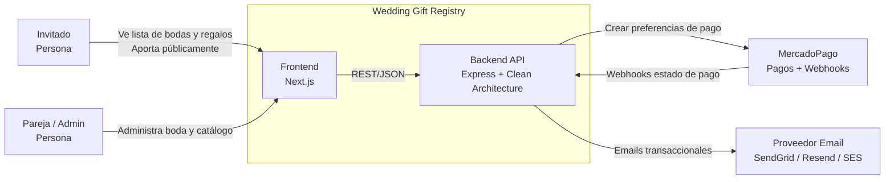

# C1 – Diagrama de contexto

```mermaid
flowchart LR
    %% Personas
    Guest[Invitado\nPersona]
    Couple[Pareja / Admin\nPersona]

    %% Sistema principal
    subgraph WeddingApp["Wedding Gift Registry"]
        FE[Frontend\nNext.js]
        API[Backend API\nExpress + Clean Architecture]
    end

    %% Sistemas externos
    MPago[MercadoPago\nPagos + Webhooks]
    Email[Proveedor Email\nSendGrid / Resend / SES]

    %% Relaciones principales
    Guest -->|Ve lista de bodas y regalos\nAporta públicamente| FE
    Couple -->|Administra boda y catálogo| FE
    FE -->|REST/JSON| API

    %% Integraciones backend
    API -->|Crear preferencias de pago| MPago
    MPago -->|Webhooks estado de pago| API
    API -->|Emails transaccionales| Email
```
