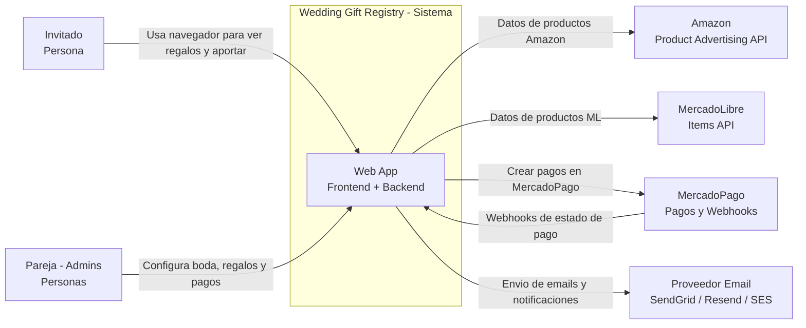

# C1 – Diagrama de contexto

```mermaid
flowchart LR
    %% Personas
    Guest[Invitado\nPersona]
    Couple[Pareja - Admins\nPersonas]

    %% Sistema
    subgraph System["Wedding Gift Registry - Sistema"]
        WebApp[Web App\nFrontend + Backend]
    end

    %% Sistemas externos
    Amazon[Amazon\nProduct Advertising API]
    ML[MercadoLibre\nItems API]
    MPago[MercadoPago\nPagos y Webhooks]
    Email[Proveedor Email\nSendGrid / Resend / SES]

    %% Relaciones
    Guest -->|Usa navegador para ver regalos y aportar| WebApp
    Couple -->|Configura boda, regalos y pagos| WebApp

    WebApp -->|Datos de productos Amazon| Amazon
    WebApp -->|Datos de productos ML| ML

    WebApp -->|Crear pagos en MercadoPago| MPago
    MPago -->|Webhooks de estado de pago| WebApp

    WebApp -->|Envio de emails y notificaciones| Email
```
