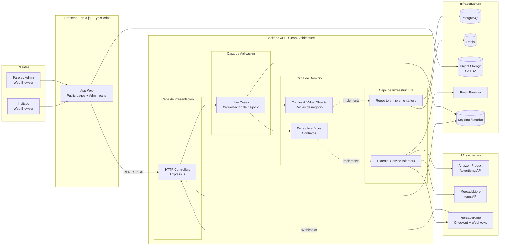

# C2 – Diagrama de contenedores

## Principios de Clean Architecture

- **Dependency Rule**: Las dependencias apuntan hacia adentro (Infrastructure → Application → Domain)
- **Domain Layer**: Contiene entidades, value objects y reglas de negocio puras
- **Application Layer**: Contiene use cases que orquestan el flujo de la aplicación
- **Infrastructure Layer**: Implementaciones concretas de repositorios y servicios externos
- **Ports & Adapters**: Los use cases dependen de interfaces (ports), no de implementaciones concretas
