# C3 – Diagrama de componentes (backend) - Clean Architecture

```mermaid
flowchart TB
    %% Cliente
    FE[Frontend Next.js\nApp Web]

    %% Backend API - Clean Architecture
    subgraph BackendAPI[Backend API - Clean Architecture]

        %% ========================================
        %% INFRASTRUCTURE LAYER - HTTP Adapters
        %% ========================================
        subgraph HTTPAdapters[Infrastructure: HTTP Adapters]
            AuthCtrl[AuthController]
            WeddingCtrl[WeddingController]
            GiftCtrl[GiftController]
            ContribCtrl[ContributionController]
            PaymentCtrl[PaymentController]
            AuthMW[Auth Middleware]
            ErrorHandler[Error Handler]
        end

        %% ========================================
        %% APPLICATION LAYER - Use Cases
        %% ========================================
        subgraph UseCases[Application: Use Cases]
            subgraph AuthUC[Auth]
                RegisterUC[RegisterUserUseCase]
                LoginUC[LoginUserUseCase]
                ValidateTokenUC[ValidateTokenUseCase]
            end
            
            subgraph WeddingUC[Wedding]
                CreateWeddingUC[CreateWeddingUseCase]
                GetWeddingUC[GetWeddingUseCase]
                GetBySlugUC[GetWeddingBySlugUseCase]
                GetUserWeddingsUC[GetUserWeddingsUseCase]
                UpdateWeddingUC[UpdateWeddingUseCase]
                DeleteWeddingUC[DeleteWeddingUseCase]
            end
            
            subgraph GiftUC[Gift]
                CreateGiftUC[CreateGiftUseCase]
                GetGiftUC[GetGiftUseCase]
                GetWeddingGiftsUC[GetWeddingGiftsUseCase]
                UpdateGiftUC[UpdateGiftUseCase]
                DeleteGiftUC[DeleteGiftUseCase]
            end
            
            subgraph ContribUC[Contribution]
                CreateContribUC[CreateContributionUseCase]
                GetContribsUC[GetWeddingContributionsUseCase]
            end
            
            subgraph PaymentUC[Payments]
                CreatePrefUC[CreatePaymentPreferenceUseCase]
                HandleWebhookUC[HandlePaymentWebhookUseCase]
            end
        end

        %% ========================================
        %% DOMAIN LAYER - Core Business
        %% ========================================
        subgraph DomainLayer[Domain: Enterprise Business Rules]
            subgraph Entities[Entities]
                User[User]
                Wedding[Wedding]
                Gift[Gift]
                Contribution[Contribution]
            end
            
            subgraph ValueObjects[Value Objects]
                UniqueId[UniqueId]
                Email[Email]
                Money[Money]
                Slug[Slug]
            end
            
            subgraph Ports[Repository Ports]
                IUserRepo[IUserRepository]
                IWeddingRepo[IWeddingRepository]
                IGiftRepo[IGiftRepository]
                IContribRepo[IContributionRepository]
            end
            
            subgraph ServicePorts[Service Ports]
                IEmailSvc[IEmailService]
                IPaymentGW[IPaymentGateway]
                IPasswordHash[IPasswordHasher]
                ITokenSvc[ITokenService]
            end
            
            subgraph DomainErrors[Domain Errors]
                DomainErr[DomainError\nValidationError\nEntityNotFoundError]
            end
        end

        %% ========================================
        %% INFRASTRUCTURE LAYER - Implementations
        %% ========================================
        subgraph InfraImpl[Infrastructure: Implementations]
            subgraph Persistence[Repositories]
                InMemUserRepo[InMemoryUserRepository]
                InMemWeddingRepo[InMemoryWeddingRepository]
                InMemGiftRepo[InMemoryGiftRepository]
                InMemContribRepo[InMemoryContributionRepository]
            end
            
            subgraph ExternalServices[Service Adapters]
                ConsoleEmail[ConsoleEmailService]
                MockPaymentGW[MockPaymentGateway]
                SimpleHasher[SimplePasswordHasher]
                MockToken[MockTokenService]
            end
        end

        %% ========================================
        %% COMPOSITION ROOT
        %% ========================================
        subgraph Main[Composition Root]
            Container[DI Container]
            AppFactory[createApp]
            Entry[main.ts]
        end
    end

    %% External Systems
    subgraph External[External Systems]
        MPago[MercadoPago API]
        MailProvider[Email Provider]
    end

    %% ========================================
    %% RELATIONSHIPS
    %% ========================================

    %% Frontend -> HTTP Controllers
    FE -->|REST JSON| AuthCtrl
    FE -->|CRUD bodas| WeddingCtrl
    FE -->|CRUD regalos| GiftCtrl
    FE -->|Crear aportes| ContribCtrl
    FE -->|Pagos| PaymentCtrl

    %% Controllers -> Use Cases
    AuthCtrl --> RegisterUC
    AuthCtrl --> LoginUC
    AuthMW --> ValidateTokenUC
    
    WeddingCtrl --> CreateWeddingUC
    WeddingCtrl --> GetWeddingUC
    WeddingCtrl --> GetBySlugUC
    WeddingCtrl --> GetUserWeddingsUC
    WeddingCtrl --> UpdateWeddingUC
    WeddingCtrl --> DeleteWeddingUC
    
    GiftCtrl --> CreateGiftUC
    GiftCtrl --> GetGiftUC
    GiftCtrl --> GetWeddingGiftsUC
    GiftCtrl --> UpdateGiftUC
    GiftCtrl --> DeleteGiftUC
    
    ContribCtrl --> CreateContribUC
    ContribCtrl --> GetContribsUC
    
    PaymentCtrl --> CreatePrefUC
    PaymentCtrl --> HandleWebhookUC

    %% Use Cases -> Domain (Ports)
    RegisterUC --> IUserRepo
    RegisterUC --> IPasswordHash
    LoginUC --> IUserRepo
    LoginUC --> IPasswordHash
    LoginUC --> ITokenSvc
    ValidateTokenUC --> IUserRepo
    ValidateTokenUC --> ITokenSvc
    
    CreateWeddingUC --> IWeddingRepo
    GetWeddingUC --> IWeddingRepo
    GetBySlugUC --> IWeddingRepo
    GetBySlugUC --> IGiftRepo
    GetUserWeddingsUC --> IWeddingRepo
    
    CreateGiftUC --> IGiftRepo
    GetWeddingGiftsUC --> IGiftRepo
    
    CreateContribUC --> IWeddingRepo
    CreateContribUC --> IGiftRepo
    CreateContribUC --> IContribRepo
    CreateContribUC --> IEmailSvc
    CreateContribUC --> IPaymentGW
    GetContribsUC --> IContribRepo
    
    CreatePrefUC --> IContribRepo
    CreatePrefUC --> IPaymentGW
    HandleWebhookUC --> IContribRepo
    HandleWebhookUC --> IPaymentGW
    HandleWebhookUC --> IEmailSvc

    %% Use Cases -> Entities (business logic)
    CreateWeddingUC -.-> Wedding
    GetWeddingUC -.-> Wedding
    CreateGiftUC -.-> Gift
    CreateContribUC -.-> Contribution
    RegisterUC -.-> User

    %% Ports -> Implementations (Dependency Inversion)
    IUserRepo -.->|implements| InMemUserRepo
    IWeddingRepo -.->|implements| InMemWeddingRepo
    IGiftRepo -.->|implements| InMemGiftRepo
    IContribRepo -.->|implements| InMemContribRepo
    
    IEmailSvc -.->|implements| ConsoleEmail
    IPaymentGW -.->|implements| MockPaymentGW
    IPasswordHash -.->|implements| SimpleHasher
    ITokenSvc -.->|implements| MockToken

    %% Infrastructure -> External
    MockPaymentGW -.-> MPago
    ConsoleEmail -.-> MailProvider

    %% Composition Root wires everything
    Container --> AuthCtrl
    Container --> WeddingCtrl
    Container --> GiftCtrl
    Container --> ContribCtrl
    Container --> PaymentCtrl
    AppFactory --> Container
    Entry --> AppFactory
```



## Estructura de directorios

```
src/
├── domain/                    # Reglas de negocio (Entities, VOs, Ports, Errors)
│   ├── entities/
│   ├── value-objects/
│   ├── repositories/          # IUserRepository, IWeddingRepository, IGiftRepository, IContributionRepository
│   ├── services/              # IEmailService, IPaymentGateway, IPasswordHasher, ITokenService
│   └── errors/
│
├── application/               # Casos de uso + DTOs
│   ├── use-cases/
│   │   ├── auth/
│   │   ├── wedding/
│   │   ├── gift/
│   │   ├── contribution/
│   │   └── payment/
│   └── dtos/
│
├── infrastructure/            # Implementaciones de puertos + HTTP
│   ├── persistence/           # InMemory*Repository
│   ├── services/              # ConsoleEmail, MockPaymentGateway, SimplePasswordHasher, MockTokenService
│   └── http/
│       ├── controllers/       # Express controllers
│       ├── middleware/        # Auth middleware
│       └── errorHandler.ts    # HTTP error mapping
│
└── main/                      # Composition Root
    ├── container.ts           # Dependency injection
    ├── app.ts                 # Express app factory
    └── main.ts                # Entry point
```

## Principios aplicados

| Principio | Implementación |
|-----------|----------------|
| **Single Responsibility** | Cada Use Case tiene una única responsabilidad |
| **Open/Closed** | Nuevas funcionalidades = nuevos Use Cases |
| **Liskov Substitution** | Interfaces permiten intercambiar implementaciones |
| **Interface Segregation** | Ports específicos por dominio |
| **Dependency Inversion** | Use Cases dependen de abstracciones (Ports) |
