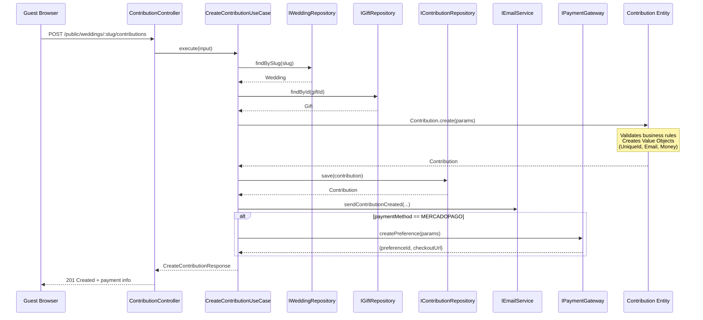
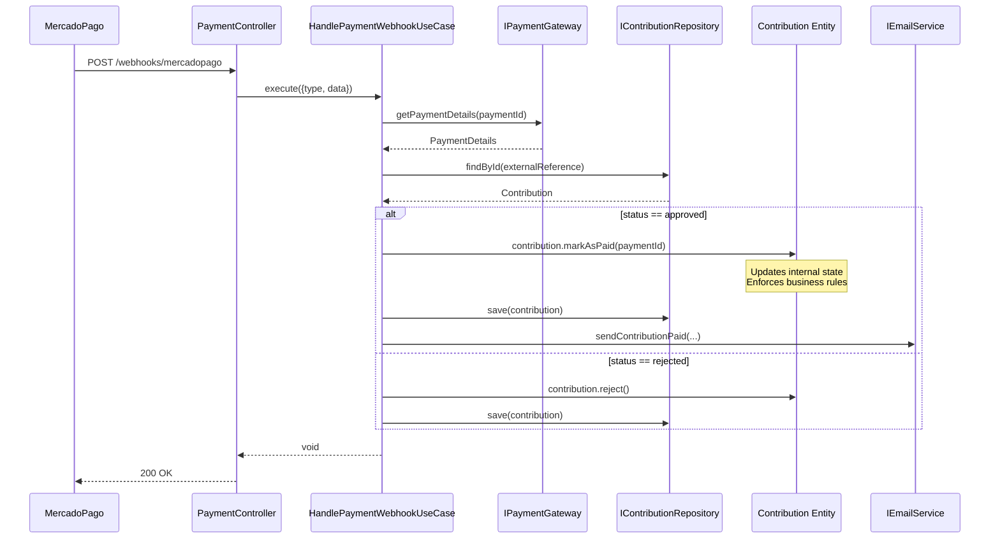

# C4 – Diagrama de código (módulo de pagos) - Clean Architecture

## Diagrama de clases por capas

```mermaid
classDiagram
    %% ============================================
    %% DOMAIN LAYER - Entities & Value Objects
    %% ============================================
    namespace Domain {
        class Contribution {
            -_id: UniqueId
            -_weddingId: UniqueId
            -_giftId: UniqueId
            -_guestName: string
            -_guestEmail: Email
            -_type: ContributionType
            -_amount: Money
            -_status: ContributionStatus
            -_paymentProvider: PaymentProvider
            -_paymentProviderId: string
            -_createdAt: Date
            +create()$ Contribution
            +fromPersistence()$ Contribution
            +isPending() bool
            +isPaid() bool
            +markAsPaid(paymentId) void
            +reject() void
            +toPersistence() object
        }

        class Money {
            -_amount: number
            -_currency: string
            +create(amount, currency)$ Money
            +zero(currency)$ Money
            +add(other) Money
            +equals(other) bool
        }

        class Email {
            -_value: string
            +create(value)$ Email
            +fromPersistence(value)$ Email
            +equals(other) bool
        }

        class UniqueId {
            -_value: string
            +create()$ UniqueId
            +fromString(value)$ UniqueId
            +equals(other) bool
        }
    }

    %% ============================================
    %% DOMAIN LAYER - Ports (Interfaces)
    %% ============================================
    namespace DomainPorts {
        class IContributionRepository {
            <<interface>>
            +findById(id) Promise~Contribution~
            +findByWeddingId(weddingId) Promise~Contribution[]~
            +findByPaymentProviderId(id) Promise~Contribution~
            +save(contribution) Promise~Contribution~
        }

        class IPaymentGateway {
            <<interface>>
            +createPreference(params) Promise~PaymentPreferenceResult~
            +getPaymentDetails(paymentId) Promise~PaymentDetails~
        }

        class IEmailService {
            <<interface>>
            +sendContributionCreated(email, name, gift) Promise~void~
            +sendContributionPaid(email, name, amount) Promise~void~
        }
    }

    %% ============================================
    %% APPLICATION LAYER - Use Cases
    %% ============================================
    namespace Application {
        class CreateContributionUseCase {
            -weddingRepository: IWeddingRepository
            -giftRepository: IGiftRepository
            -contributionRepository: IContributionRepository
            -emailService: IEmailService
            -paymentGateway: IPaymentGateway
            +execute(input) Promise~CreateContributionResponse~
        }

        class CreatePaymentPreferenceUseCase {
            -contributionRepository: IContributionRepository
            -paymentGateway: IPaymentGateway
            +execute(input) Promise~PaymentPreferenceOutput~
        }

        class HandlePaymentWebhookUseCase {
            -contributionRepository: IContributionRepository
            -paymentGateway: IPaymentGateway
            -emailService: IEmailService
            +execute(input) Promise~void~
        }

        class CreateContributionInput {
            +weddingSlug: string
            +giftId: string
            +guestName: string
            +guestEmail: string
            +type: ContributionType
            +amount: number
            +currency: string
            +paymentMethod: PaymentProvider
        }

        class CreateContributionResponse {
            +contributionId: string
            +status: ContributionStatus
            +payment: PaymentInfo
        }
    }

    %% ============================================
    %% INFRASTRUCTURE LAYER - Implementations
    %% ============================================
    namespace Infrastructure {
        class InMemoryContributionRepository {
            -contributions: Map
            +findById(id) Promise~Contribution~
            +findByWeddingId(weddingId) Promise~Contribution[]~
            +findByPaymentProviderId(id) Promise~Contribution~
            +save(contribution) Promise~Contribution~
        }

        class MockPaymentGateway {
            -payments: Map
            +createPreference(params) Promise~PaymentPreferenceResult~
            +getPaymentDetails(paymentId) Promise~PaymentDetails~
            +simulatePayment(id, status) void
        }

        class ConsoleEmailService {
            +sendContributionCreated(email, name, gift) Promise~void~
            +sendContributionPaid(email, name, amount) Promise~void~
        }

        class ContributionController {
            -createContributionUseCase: CreateContributionUseCase
            -getWeddingContributionsUseCase: GetWeddingContributionsUseCase
            +createPublicContribution(req, res) Promise~void~
            +getWeddingContributions(req, res) Promise~void~
        }

        class PaymentController {
            -createPaymentPreferenceUseCase: CreatePaymentPreferenceUseCase
            -handlePaymentWebhookUseCase: HandlePaymentWebhookUseCase
            +createPreference(req, res) Promise~void~
            +handleWebhook(req, res) Promise~void~
        }
    }

    %% ============================================
    %% RELATIONSHIPS
    %% ============================================

    %% Domain - Entities use Value Objects
    Contribution --> UniqueId
    Contribution --> Email
    Contribution --> Money

    %% Ports extend from Domain
    IContributionRepository ..> Contribution : uses

    %% Use Cases depend on Ports (Dependency Inversion)
    CreateContributionUseCase --> IContributionRepository
    CreateContributionUseCase --> IPaymentGateway
    CreateContributionUseCase --> IEmailService
    CreateContributionUseCase ..> Contribution : creates
    CreateContributionUseCase ..> CreateContributionInput : input
    CreateContributionUseCase ..> CreateContributionResponse : output

    CreatePaymentPreferenceUseCase --> IContributionRepository
    CreatePaymentPreferenceUseCase --> IPaymentGateway

    HandlePaymentWebhookUseCase --> IContributionRepository
    HandlePaymentWebhookUseCase --> IPaymentGateway
    HandlePaymentWebhookUseCase --> IEmailService

    %% Infrastructure implements Ports
    InMemoryContributionRepository ..|> IContributionRepository : implements
    MockPaymentGateway ..|> IPaymentGateway : implements
    ConsoleEmailService ..|> IEmailService : implements

    %% Controllers use Use Cases
    ContributionController --> CreateContributionUseCase
    PaymentController --> CreatePaymentPreferenceUseCase
    PaymentController --> HandlePaymentWebhookUseCase
```

## Flujo de creación de contribución

## Flujo de webhook de pago

## Beneficios de Clean Architecture en este módulo

| Aspecto | Beneficio |
|---------|-----------|
| **Testabilidad** | Use Cases se pueden testear con mocks de los ports |
| **Flexibilidad** | Cambiar MercadoPago por Stripe = solo nueva implementación de `IPaymentGateway` |
| **Mantenibilidad** | Lógica de negocio aislada en entidades y use cases |
| **Escalabilidad** | Agregar funcionalidad = nuevo use case, sin tocar existentes |
