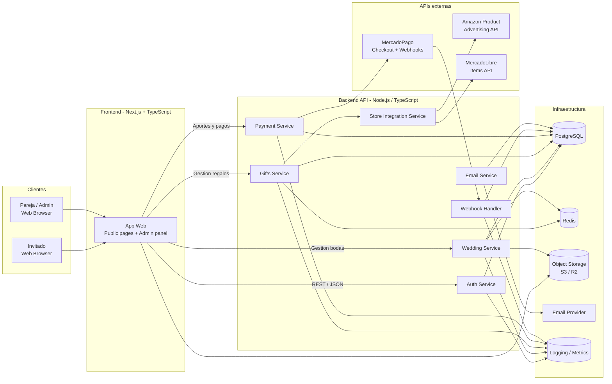

# C2 – Diagrama de contenedores

```mermaid
flowchart LR
    %% Clientes
    subgraph Clients[Clientes]
        Guest[Invitado\nWeb Browser]
        Couple[Pareja / Admin\nWeb Browser]
    end

    %% Frontend
    subgraph Frontend[Frontend - Next.js + TypeScript]
        FEApp[App Web\nPublic pages + Admin panel]
    end

    %% Backend
    subgraph Backend[Backend API - Node.js / TypeScript]
        AuthSvc[Auth Service]
        WeddingSvc[Wedding Service]
        GiftsSvc[Gifts Service]
        PaymentSvc[Payment Service]
        WebhookSvc[Webhook Handler]
        EmailSvc[Email Service]
        StoreIntSvc[Store Integration Service]
    end

    %% Infra
    subgraph Infra[Infraestructura]
        DB[(PostgreSQL)]
        Cache[(Redis)]
        Storage[(Object Storage\nS3 / R2)]
        Mail[Email Provider]
        Logs[(Logging / Metrics)]
    end

    %% Externos
    subgraph External[APIs externas]
        AmazonAPI[Amazon Product\nAdvertising API]
        MLAPI[MercadoLibre\nItems API]
        MPago[MercadoPago\nCheckout + Webhooks]
    end

    %% Navegadores -> Frontend
    Guest --> FEApp
    Couple --> FEApp

    %% Frontend -> Backend
    FEApp -->|REST / JSON| AuthSvc
    FEApp -->|Gestion bodas| WeddingSvc
    FEApp -->|Gestion regalos| GiftsSvc
    FEApp -->|Aportes y pagos| PaymentSvc

    %% Backend interno -> DB / Cache / Storage / Mail
    AuthSvc --> DB
    WeddingSvc --> DB
    GiftsSvc --> DB
    PaymentSvc --> DB
    WebhookSvc --> DB
    EmailSvc --> DB

    GiftsSvc --> Cache
    WeddingSvc --> Cache

    FEApp --> Storage
    WeddingSvc --> Storage

    EmailSvc --> Mail

    %% Integraciones tiendas
    GiftsSvc --> StoreIntSvc
    StoreIntSvc --> AmazonAPI
    StoreIntSvc --> MLAPI

    %% MercadoPago
    PaymentSvc --> MPago
    MPago --> WebhookSvc

    %% Logs
    AuthSvc --> Logs
    WeddingSvc --> Logs
    GiftsSvc --> Logs
    PaymentSvc --> Logs
    WebhookSvc --> Logs
```
