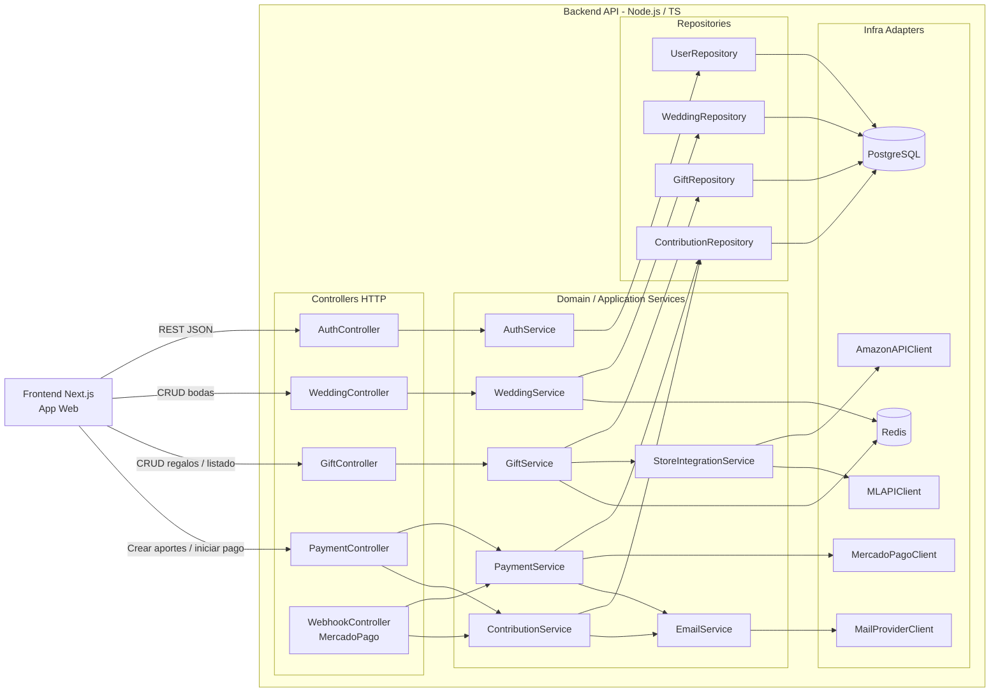

# C3 – Diagrama de componentes (backend)

```mermaid
flowchart LR
    %% Cliente
    FE[Frontend Next.js\nApp Web]

    %% Backend API
    subgraph BackendAPI[Backend API - Node.js / TS]

        subgraph Controllers[Controllers HTTP]
            AuthCtrl[AuthController]
            WeddingCtrl[WeddingController]
            GiftCtrl[GiftController]
            PaymentCtrl[PaymentController]
            WebhookCtrl[WebhookController\nMercadoPago]
        end

        subgraph Services[Domain / Application Services]
            AuthSvc[AuthService]
            WeddingSvc[WeddingService]
            GiftSvc[GiftService]
            PaymentSvc[PaymentService]
            ContributionSvc[ContributionService]
            StoreIntSvc[StoreIntegrationService]
            EmailSvc[EmailService]
        end

        subgraph Persistence[Repositories]
            UserRepo[UserRepository]
            WeddingRepo[WeddingRepository]
            GiftRepo[GiftRepository]
            ContributionRepo[ContributionRepository]
        end

        subgraph Infra[Infra Adapters]
            MPagoClient[MercadoPagoClient]
            AmazonClient[AmazonAPIClient]
            MLClient[MLAPIClient]
            MailClient[MailProviderClient]
            DB[(PostgreSQL)]
            Cache[(Redis)]
        end
    end

    %% Frontend -> Controllers
    FE -->|REST JSON| AuthCtrl
    FE -->|CRUD bodas| WeddingCtrl
    FE -->|CRUD regalos / listado| GiftCtrl
    FE -->|Crear aportes / iniciar pago| PaymentCtrl

    %% Controllers -> Services
    AuthCtrl --> AuthSvc
    WeddingCtrl --> WeddingSvc
    GiftCtrl --> GiftSvc
    PaymentCtrl --> PaymentSvc
    PaymentCtrl --> ContributionSvc
    WebhookCtrl --> PaymentSvc
    WebhookCtrl --> ContributionSvc

    %% Services -> Repos
    AuthSvc --> UserRepo
    WeddingSvc --> WeddingRepo
    GiftSvc --> GiftRepo
    ContributionSvc --> ContributionRepo
    PaymentSvc --> ContributionRepo

    %% Services -> Integraciones
    GiftSvc --> StoreIntSvc
    StoreIntSvc --> AmazonClient
    StoreIntSvc --> MLClient

    PaymentSvc --> MPagoClient
    EmailSvc --> MailClient

    %% Repos -> DB
    UserRepo --> DB
    WeddingRepo --> DB
    GiftRepo --> DB
    ContributionRepo --> DB

    %% Cache
    GiftSvc --> Cache
    WeddingSvc --> Cache

    %% Email desde servicios
    ContributionSvc --> EmailSvc
    PaymentSvc --> EmailSvc
```
