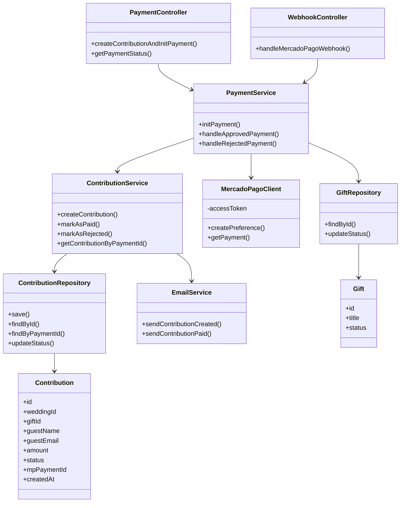

# C4 – Diagrama de código (ejemplo módulo de pagos)

```mermaid
classDiagram
    class PaymentController {
        +createContributionAndInitPayment()
        +getPaymentStatus()
    }

    class WebhookController {
        +handleMercadoPagoWebhook()
    }

    class PaymentService {
        +initPayment()
        +handleApprovedPayment()
        +handleRejectedPayment()
    }

    class ContributionService {
        +createContribution()
        +markAsPaid()
        +markAsRejected()
        +getContributionByPaymentId()
    }

    class MercadoPagoClient {
        +createPreference()
        +getPayment()
        -accessToken
    }

    class ContributionRepository {
        +save()
        +findById()
        +findByPaymentId()
        +updateStatus()
    }

    class GiftRepository {
        +findById()
        +updateStatus()
    }

    class EmailService {
        +sendContributionCreated()
        +sendContributionPaid()
    }

    class Contribution {
        +id
        +weddingId
        +giftId
        +guestName
        +guestEmail
        +amount
        +status
        +mpPaymentId
        +createdAt
    }

    class Gift {
        +id
        +title
        +status
    }

    PaymentController --> PaymentService
    WebhookController --> PaymentService

    PaymentService --> ContributionService
    PaymentService --> MercadoPagoClient
    PaymentService --> GiftRepository

    ContributionService --> ContributionRepository
    ContributionService --> EmailService

    ContributionRepository --> Contribution
    GiftRepository --> Gift
```
